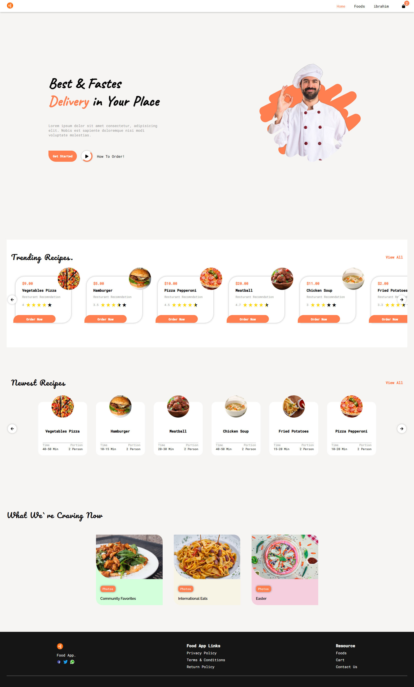
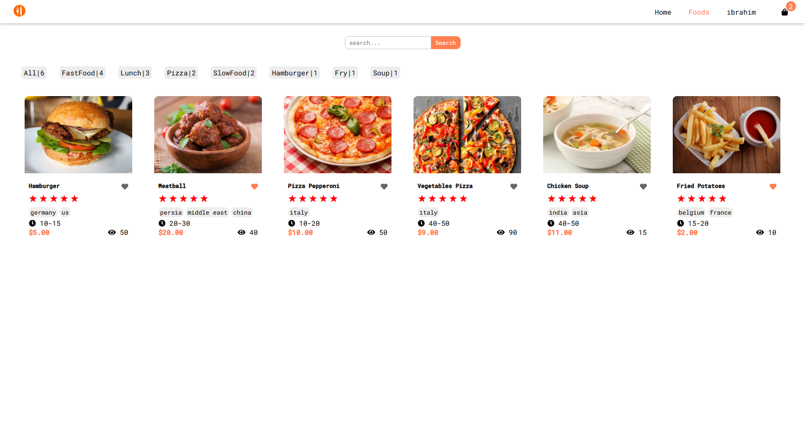
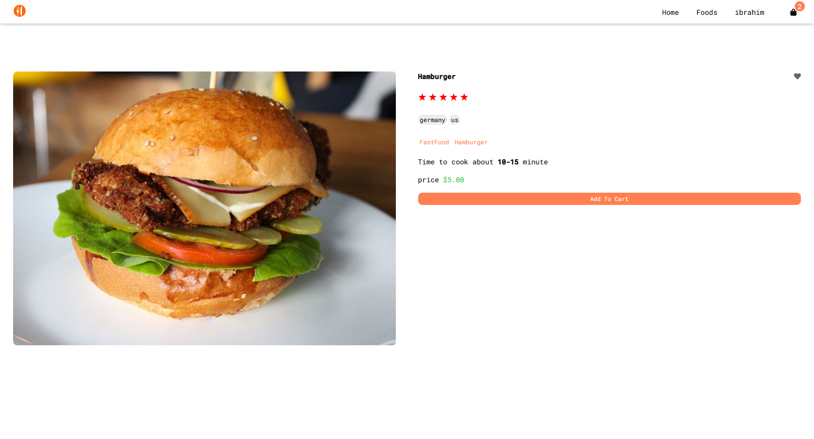
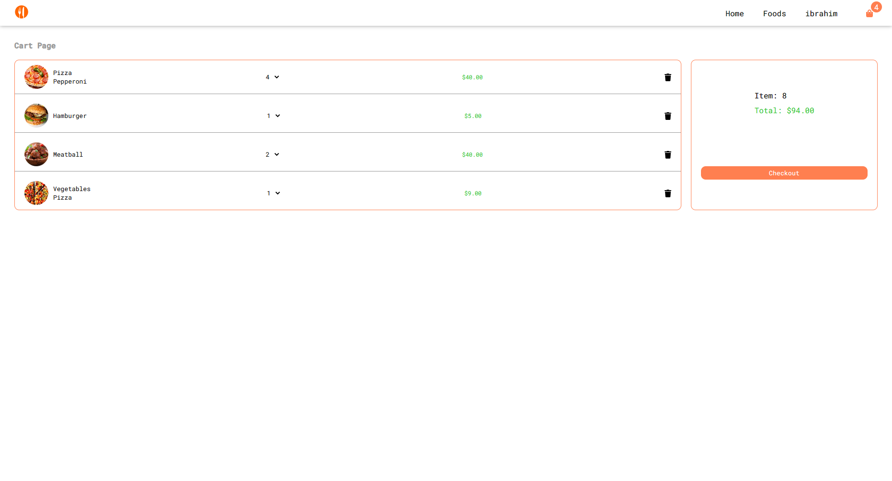
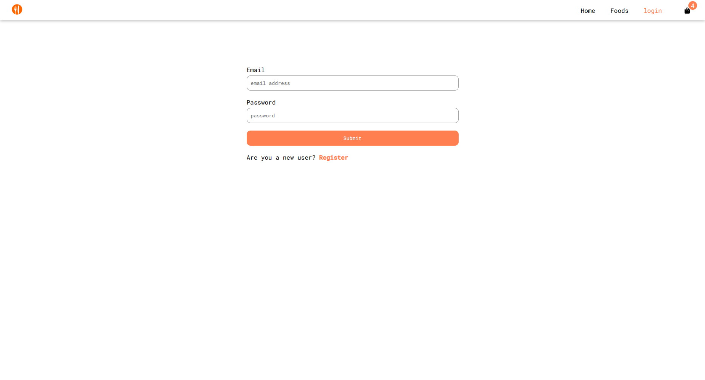
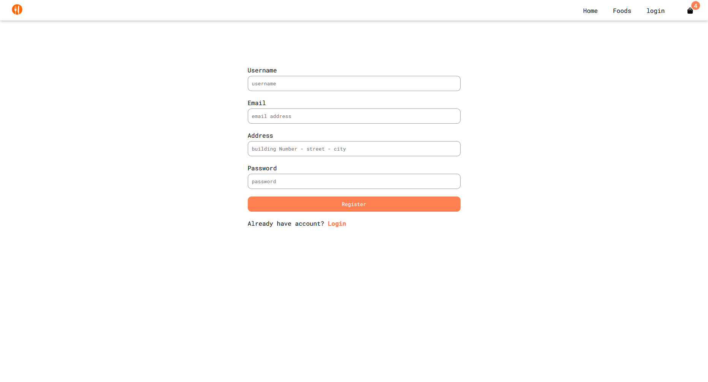
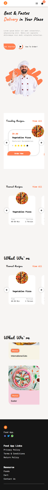

# Angular Application
## Frontend Food Ordering 

## Start Project 
```bash
- npm install
- npm install -g @angular/cli
- ng serve
```
## Backend App Link:
- https://github.com/ibrahim2375/Food-Ordering-Backend-App
## Application View Web
### Home


### Foods

### Food

### Cart

### Login

### Register


## Application View Mobile
### Mobile

